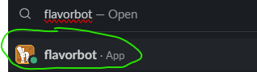
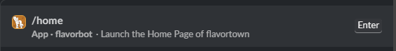
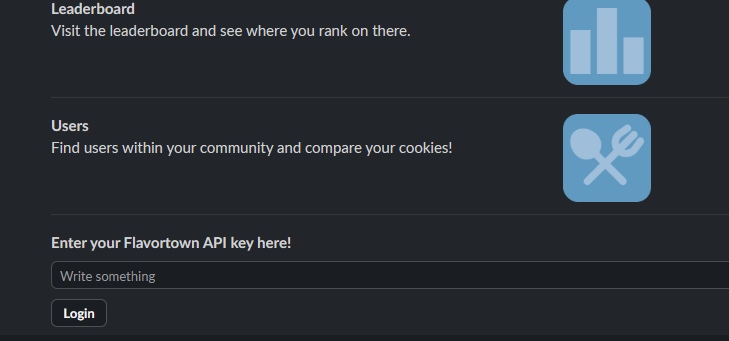

# FlavorBot

Here is how to interact with the flavorbot on slack
## Getting Started

### 1. Open FlavorBot in Slack

In the Hack Club Slack, search for **FlavorBot** using the search bar.

> 

### 2. Send the /home command

In the FlavorBot DM, type `/home` and hit enter. This opens the main menu.

> 

### 3. Log in with your FlavorTown API key

If it's your first time, you'll be prompted to enter your FlavorTown API key. You can find it in your FlavorTown profile settings.

> 

